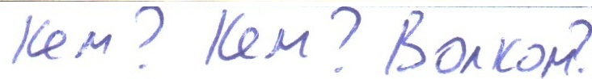
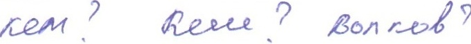
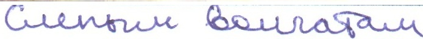
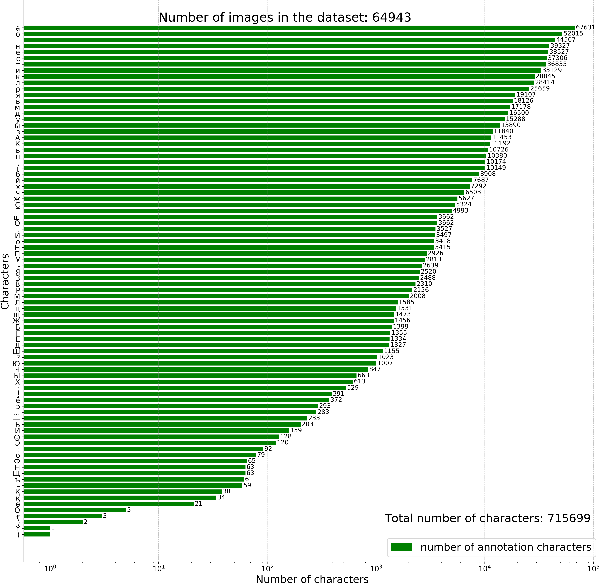

# Handwritten Kazakh and Russian (HKR) database for text recognition

The HKR Dataset for Russian and Kazakh database (with about 95% of Russian and 5% of
Kazakh words/sentences respectively) for offline handwriting recognition.
The dataset can be downloaded through the following link:

- [Cloud](https://cloud.mail.ru/public/25xw/2YPdtaFAF)  

## Description
The database is written in Cyrillic and shares the same 33 characters. Besides these characters, the Kazakh alphabet also contains 9 additional
specific characters. This dataset is a collection of forms. The sources of all the forms in the datasets were generated by LATEX which subsequently was filled out by
persons with their handwriting. The database consists of more than 1400 filled forms. There are approximately 63000 sentences, more than 715699 symbols produced by approximately 200 diferent writers.
We utilized three different datasets described as following:
* Handwritten samples (Forms) of keywords in Kazakh and Russian (Areas, Cities , Village , etc.)
* Handwritten Kazakh and Russian alphabet in cyrillic
* Handwritten samples (Forms) of poems in Russian

The following are some sample of forms from HKR dataset:

The following are some word images after segmented the forms:

For example, the following image shows the number of character in the HKR dataset.

